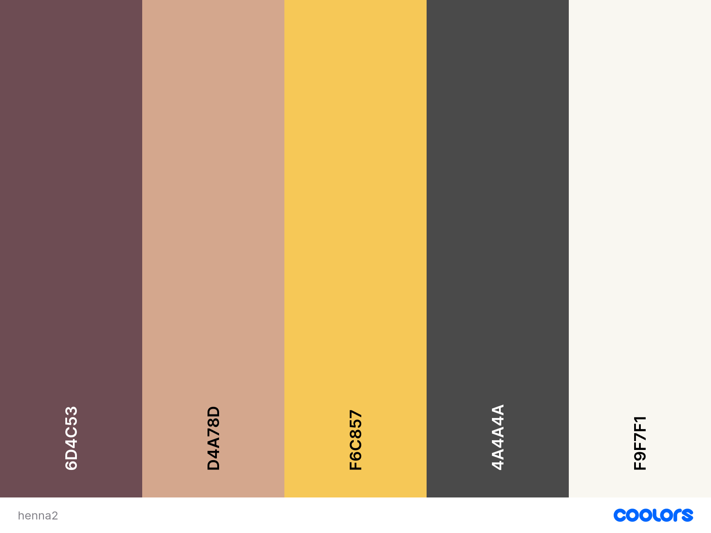
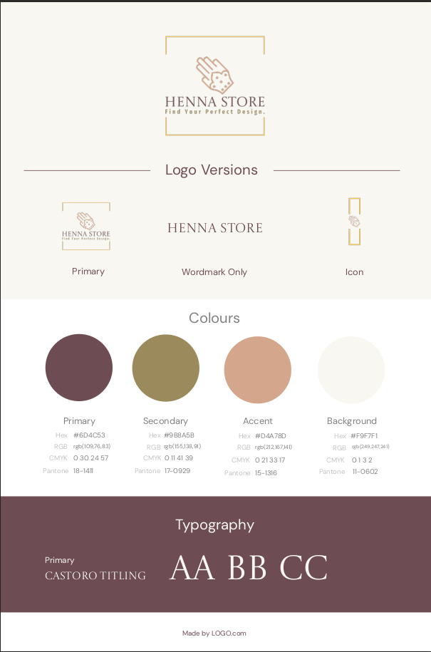
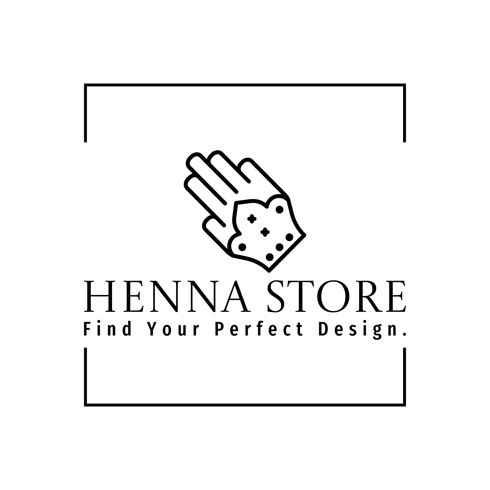
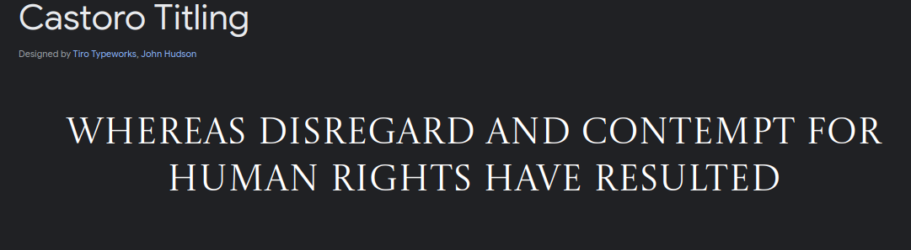

# Henna

## Table of Contents

1. [Introduction](#introduction)
2. [Objective](#objective)
3. [Key Features](#key-features)
    - [Navigation](#navigation)
    - [Home Page](#home-page)
    - [Profile Page](#profile-page)
    - [Admin Panel Feature](#admin-panel-feature)
    - [Booking Page](#booking-page)
4. [UX/UI](#uxui)
    - [User Stories](#user-stories)
        - [New Visitor](#new-visitor)
        - [Returning User](#returning-user)
        - [Frequent User](#frequent-user)
        - [Admin](#admin)
    - [Colour Scheme](#colour-scheme)
        - [Primary Colour](#primary-colour)
        - [Secondary Colour](#secondary-colour)
        - [Accent Colour](#accent-colour)
        - [Supporting Colours](#supporting-colours)
        - [Background Colour](#background-colour)
    - [Typography](#typography)
5. [Wireframes](#wireframes)

---

This TOC links to the respective sections in the document, making it easy to navigate.
## Introduction
Welcome to Henna, my Milestone Project 4 for the Level 5 Diploma in Full Stack Web Application Development! This project will demonstrate my full-stack web development skills by creating a seamless and user-friendly platform for booking henna services and purchasing henna products.

## Objective
The main aim of Henna is to offer a seamless, intuitive, and engaging experience for clients looking to book henna services and buy henna products. The application uses modern web technologies to provide a dynamic solution that meets both personal and commercial needs.

## Key Features

- **User Management:** Allows users to register, log in, and manage their accounts easily.

- **Service Booking:** Enables users to browse, select, and book henna services with real-time availability.

- **Product Purchasing:** Offers a detailed catalogue of henna products, with features to add items to a cart and proceed through a secure checkout process.

- **Secure Payments:** Integrates Stripe for safe and efficient payment handling.

- **Media Storage:** Utilises Amazon S3 for reliable and scalable storage of media files, such as images of henna designs and product photos.

- **Admin Panel:** Provides administrators with tools to manage service listings, product inventories, and user accounts.

### Navigation

### Home Page

### Profile Page

### Admin Panel Feature

### Booking Page

## UX/UI
### User Stories

**New Visitor**
- As a first-time visitor, I want to explore the available henna services and products without needing to create an account, so I can decide if I’m interested in what’s on offer.

- As a first-time visitor, I want to see detailed information about each service and product, including prices and customer reviews, so I can make an informed decision.

- As a first-time visitor, I want to sign up easily using my email or social media accounts, so I can quickly access all features of the platform.

- As a first-time visitor, I want to receive a discount code for my first booking or purchase, so I feel encouraged to try the service.

**As a Returning User**
- As a returning user, I want to log in quickly to my account with saved credentials, so I can continue where I left off.

- As a returning user, I want to see the items I previously added to my cart, so I can easily pick up my shopping where I left off.

- As a returning user, I want to view my past bookings and purchases, so I can reorder products or rebook services I liked.

- As a returning user, I want to be informed about any special offers or discounts available to returning customers, so I feel valued and motivated to complete a purchase.

**As a Frequent User**
-  As a frequent user, I want to rebook my favourite henna artist service quickly, so I can save time and effort.
Loyalty Programme:

- As a frequent user, I want to earn loyalty points or rewards with each booking or purchase, so I feel appreciated and encouraged to keep using the app.

- As a frequent user, I want to receive personalised offers and discounts based on my history, so I can enjoy special perks tailored to my preferences.
Quick Access to History:

- As a frequent user, I want to access my full booking and purchase history easily, so I can track my activity and reorder or rebook with minimal effort.

**As an Admin**
- As an admin, I want to add, update, or remove services and products from the catalogue, so I can keep the offerings current and relevant.

- As an admin, I want to view and manage user accounts, including resetting passwords and handling account issues, so I can ensure a smooth user experience.

- As an admin, I want to view and manage all orders and bookings, including processing refunds and handling cancellations, so I can maintain efficient operations.

- As an admin, I want to create and manage discount codes and promotions, so I can attract more customers and drive sales.

---

### Colour Scheme

For the Henna web application, I’ve selected a streamlined colour scheme to ensure both style and readability:

#### **Primary Colour**

- **Deep Burgundy (#6D4C53)**
  - *Usage:* Main accents, buttons, links.
  - *Reason:* Offers a rich and elegant appearance, perfect for highlighting key elements.

#### **Secondary Colour**

- **Warm Sand (#D4A78D)**
  - *Usage:* Backgrounds, cards, and highlights.
  - *Reason:* Provides a warm, neutral backdrop that complements the primary colour and creates a calming effect.

#### **Accent Colour**

- **Golden Ochre (#F6C857)**
  - *Usage:* Call-to-action buttons, highlights, and active elements.
  - *Reason:* Adds a vibrant contrast that draws attention to important actions and features.

#### **Supporting Colours**

- **Soft Olive (#9B8A5B)** and **Charcoal Grey (#4A4A4A)**
  - *Usage:* Secondary buttons, text, and subtle details.
  - *Reason:* Enhances contrast and readability without overpowering the primary palette.

#### **Background Colour**

- **Light Beige (#F9F7F1)**
  - *Usage:* Main background.
  - *Reason:* Ensures a clean, unobtrusive backdrop that enhances overall readability.

---
### Branding

-  **Logo**

-  **Favicon**

### Typography

I’ve selected five different fonts for the Henna web application to achieve a visually appealing and functional design that enhances the user experience. Each font has a specific role: 

- **[Playfair Display](https://fonts.google.com/specimen/Playfair+Display)** adds elegance to headings.

- **[Lora](https://fonts.google.com/specimen/Lora)** provides readability for body text.

- **[Castoro Titling](https://fonts.google.com/specimen/Castoro+Titling)** offers a modern touch for subheadings and UI elements.

- **[Open Sans](https://fonts.google.com/specimen/Open+Sans)** ensures clarity and accessibility for general content.

- **[Pacifico](https://fonts.google.com/specimen/Pacifico)** adds a unique character to decorative elements.

---

### Wireframes

#### Home Page

####  Products Page 

-  **Product Details Page**

#### Dashboards

-  **User Dashboard**

-  **Admin Dashboard**

## UML Use Case Diagram

I have created the UML Use Case Diagram to depict how different types of users and administrators interact with the system. The diagram features actors such as New Visitor, Registered User (including Returning User and Frequent User), and Admin. It outlines essential functionalities like browsing products, managing services and orders, processing payments, and handling user accounts. I have used `<<include>>` to show mandatory interactions and `<<extend>>` for optional ones, providing a clear overview of how these components are connected.

Below is the diagram image for a visual representation:

## Database

For development, I utilised the SQLite3 database, as it is the default option for Django projects and is straightforward to set up in a development environment. When the site moves to Heroku, I will switch to PostgreSQL, provided by Code Institute. PostgreSQL is better suited for production, delivering enhanced performance, scalability, and efficient management of larger datasets and multiple users.

---

### Entity-Relationship Diagram (ERD)

The Entity-Relationship Diagram (ERD) for this project provides a clear representation of the database structure. It shows how key entities such as users, roles, profiles, services, products, orders, bookings, and reviews are related to each other. The diagram helps define how data will be organised and managed within the application, ensuring smooth operation and scalability.

The ERD includes the following relationships:

- **User - Role (Many-to-One):** Multiple users can have the same role, which defines their permissions and access levels, such as regular user, owner, or admin.

- **User - Profile (One-to-One):** Each user can have one profile that stores personal details. However, having a profile is optional for some roles, like admins.

- **User - Address (One-to-Many):** A user can have several addresses, which could be used for billing, shipping, or service locations.

- **User - Booking (One-to-Many):** A user can make multiple bookings, allowing them to book various services over time.

- **User - Order (One-to-Many):** A user can place multiple orders, with each order potentially containing several items.

- **User - LoyaltyPoint (One-to-One):** Each user has a single set of loyalty points, which they earn through bookings or purchases.

- **Order - OrderItem (One-to-Many):** An order can contain several items, representing individual products included in that order.

- **OrderItem - Product (Many-to-One):** Many order items can be linked to a single product, associating products with specific orders.

- **Booking - Service (Many-to-One):** Multiple bookings can refer to the same service, allowing users to book a particular service multiple times.

- **Review - User (Many-to-One):** A user can write several reviews, offering feedback on different services or products.

- **Review - Service (Many-to-One):** Many reviews can refer to a single service, allowing users to share their experiences with the same service.

- **Review - Product (Many-to-One, Nullable):** Several reviews can refer to a single product, although this connection is optional, especially when reviews apply to services instead of products.

This ERD ensures that the database is well-structured to handle user management, service bookings, order processing, and reviews, while also supporting features like loyalty programmes and role-based access. The design is intended to maintain efficiency and scalability as the application grows.

---

