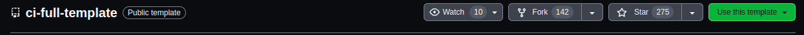
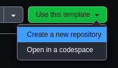
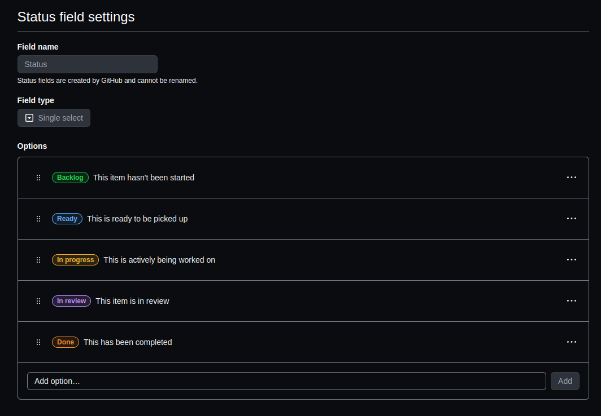
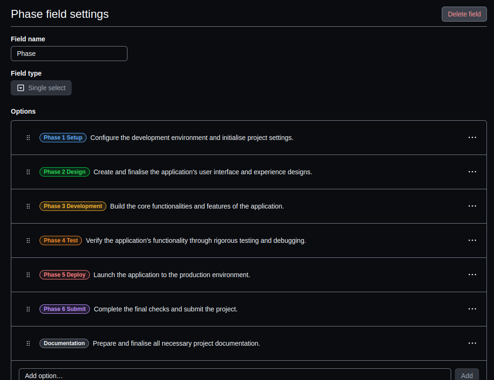
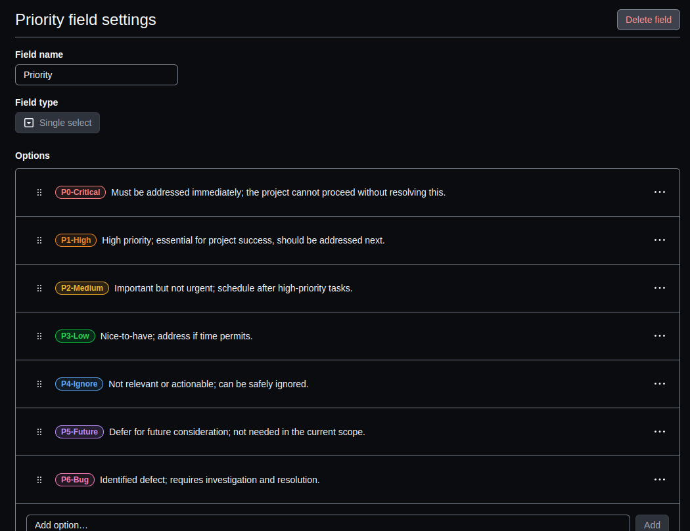
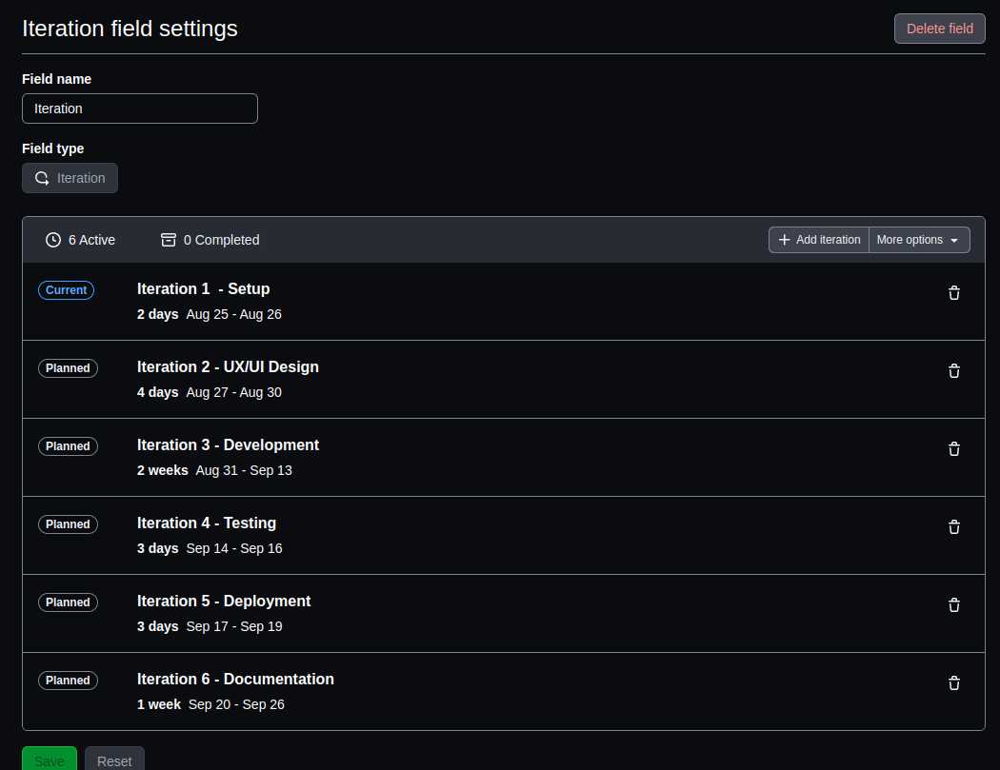
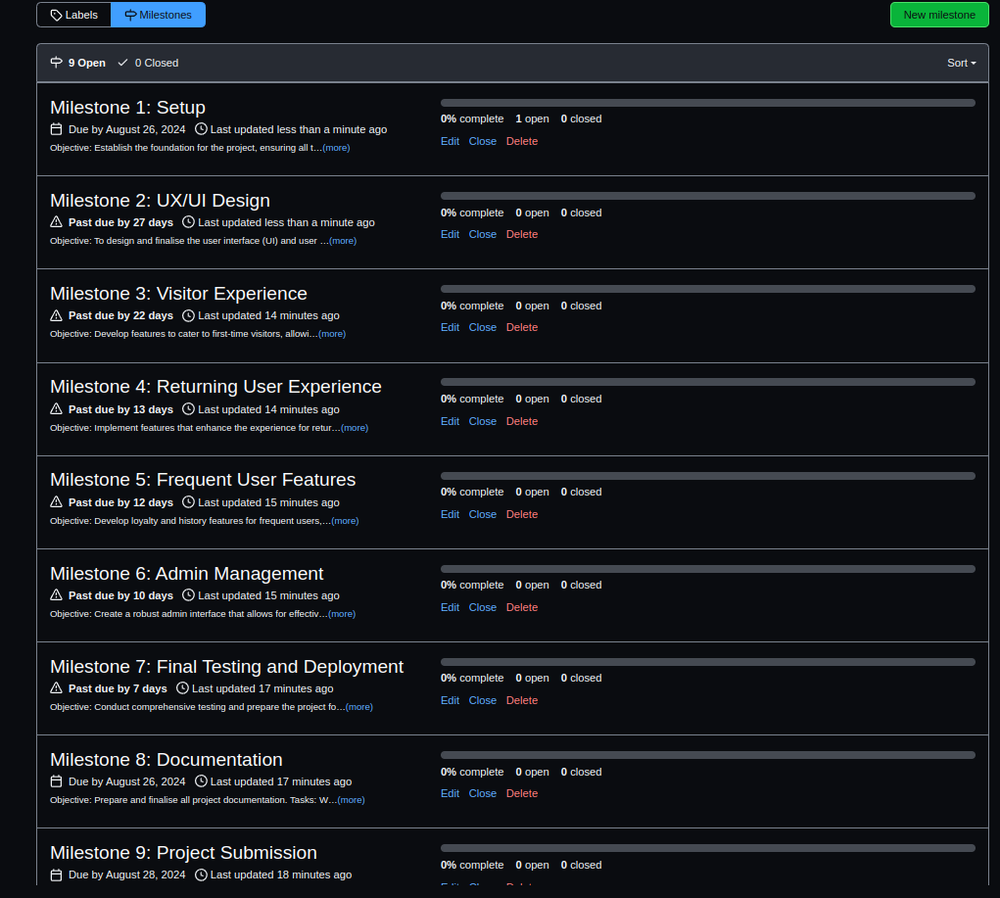
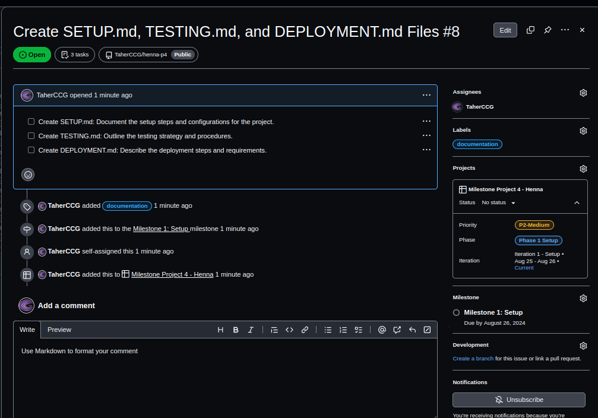
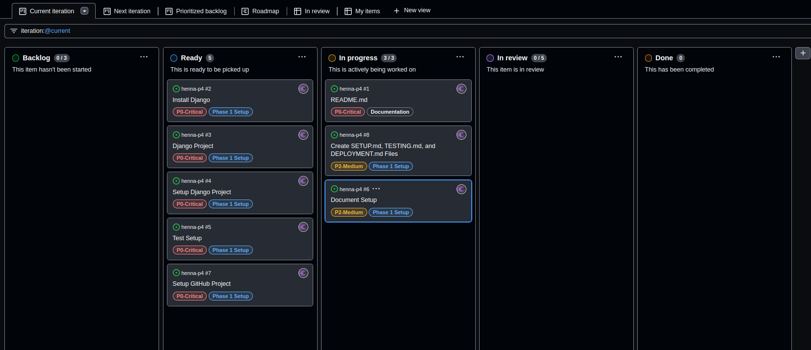

# Setup Guide for Henna Store

This guide details the steps I followed to set up the **Henna Store** project, my fourth project in the Full Stack Web Application Development course. For this project, I used Django and managed everything through GitHub, with development carried out in GitPod. I began with the Code Institute student template for GitPod, which includes all the essential tools preinstalled. Using this template is perfectly acceptable for my project submissions.

---

## Table of Contents

1. [Introduction](#1-introduction)
2. [Create GitHub Repository](#2-create-github-repository)
3. [Set Up GitHub Project](#3-set-up-github-project)
4. [Configure GitPod](#4-configure-gitpod)  
   4.1 [Open GitPod](#41-open-gitpod)  
   4.2 [Install Django and Dependencies](#42-install-django-and-dependencies)
5. [Set Up Environment Variables](#5-set-up-environment-variables)  
   5.1 [Create `env.py` File](#51-create-envpy-file)  
   5.2 [Update `.gitignore`](#52-update-gitignore)
6. [Configure Django Settings](#6-configure-django-settings)  
   6.1 [Update `settings.py`](#61-update-settingspy)
7. [Testing the Django Application](#7-testing-the-django-application)
8. [Commit and Push Changes](#8-commit-and-push-changes)  
   8.1 [Push Initial Changes](#81-push-initial-changes)
9. [Create Documentation Files](#9-create-documentation-files)

---

## 1. Introduction

This guide covers the essential steps I took to set up the **Henna Store** project. It includes instructions for creating the GitHub repository, configuring the development environment in GitPod, and setting up the project for Django development.

## 2. Create GitHub Repository

1. I started by navigating to the Code Institute’s GitHub template repository.
2. I clicked on the “Use this template” button to create a new repository.
   
   
3. I entered the repository name as `<your-project-name>` and added a brief description.
4. I initialised the repository with a README file.
5. Finally, I clicked “Create repository from template” to complete the process.

## 3. Set Up GitHub Project

1. I went to the newly created repository on GitHub.
2. I navigated to the "Projects" tab and clicked "New Project".
3. I chose a project template, such as "Basic Kanban".
4. I named the project (e.g., "Henna Store Development") and provided a description.
5. I defined columns like "To Do", "In Progress", "Review", and "Done".
   - **Status**
     
   - **Phases**
     
   - **Priority**
     
   - **Iteration**
     
   - **Milestones**
     
6. I added issues for tasks, bugs, or features, and linked them to relevant milestones (e.g., "Phase 1 - Setup", "Phase 2 - Design").
   
7. I created cards for iterations or sprints on the project board and linked them to specific issues.
   

## 4. Configure GitPod

### 4.1 Open GitPod
- I launched GitPod by appending `https://gitpod.io/#` to my repository URL (e.g., `https://gitpod.io/#https://github.com/yourusername/henna-p4`).

### 4.2 Install Django and Dependencies
- Once GitPod was loaded, I installed Django and other necessary dependencies by running:
   ```bash
   pip install django
   ```

## 5. Set Up Environment Variables

### 5.1 Create `env.py` File
- In the root directory of my project, I created a new file named `env.py` to store environment variables. I added the following lines to `env.py`:
   ```python
   import os

   os.environ["SECRET_KEY"] = "your_secret_key"
   os.environ["DEBUG"] = "True"
   os.environ["ALLOWED_HOSTS"] = "localhost"
   ```
   I replaced `"your_secret_key"` with a secure, unique key for my Django project.

### 5.2 Update `.gitignore`
- To prevent sensitive information in `env.py` from being tracked by Git, I added it to my `.gitignore` file. I opened or created a `.gitignore` file in the root directory and added:
   ```plaintext
   env.py
   ```

## 6. Configure Django Settings

### 6.1 Update `settings.py`
- I updated the `settings.py` file to use the environment variables from `env.py`. I modified the following sections in `settings.py`:
   ```python
   import os
   if os.path.exists("env.py"):
       import env

   SECRET_KEY = os.environ.get("SECRET_KEY")
   DEBUG = os.environ.get("DEBUG") == "True"
   ALLOWED_HOSTS = os.environ.get("ALLOWED_HOSTS").split(',')
   ```

## 7. Testing the Django Application

To ensure the Django application was set up correctly, I performed an initial test by running the development server.

### Steps:

1. **Run the Django Development Server**:
   - I navigated to the project directory in the terminal.
   - I used the following command to run the development server:
     ```bash
     python3 manage.py runserver
     ```
   - This command starts the Django development server, which allows me to verify that the project is correctly configured.

2. **Check for Errors**:
   - I monitored the terminal output for any errors during the server startup.
   - If the server started successfully, it indicated that the environment was correctly set up.

3. **Access the Application**:
   - I opened a web browser and navigated to `https://8000-taherccg-hennap4-4telli2ywmt.ws.codeinstitute-ide.net/` to view the application.
   - This confirmed that the Django project was running correctly.

4. **Document the Testing Process**:
   - I recorded the steps and results of this initial test in the `TESTING.md` file.

This testing ensured that the Django environment was properly configured and ready for further development.

## 8. Commit and Push Changes

### 8.1 Push Initial Changes
- I committed and pushed the changes to my GitHub repository with the following commands:
   ```bash
   git add .
   git commit -m "Initial commit Install Django"
   git push origin main
   ```

## 9. Create Documentation Files

I created the `SETUP.md`, `TESTING.md`, `DEPLOYMENT.md`, and updated `README.md` files to ensure thorough and consistent documentation from the start.

- [**SETUP.md**](SETUP.md): Details the setup steps and configurations to get the project running.

- [**TESTING.md**](TESTING.md): Outlines the testing strategy and procedures to ensure comprehensive coverage.

- [**DEPLOYMENT.md**](DEPLOYMENT.md): Describes the deployment steps and requirements for a smooth deployment.

- [**README.md**](../README.md): Provides an overview of the project, including key information and instructions for users and developers.

---