# TESTING.md

## Table of Contents

1. [Introduction](#introduction)
2. [Initial Setup Testing](#initial-setup-testing)
3. [Browser Compatibility Tests](#browser-compatibility-tests)
4. [W3C NU Validator](#w3c-nu-validator)
5. [Code Institute's Python Linter](#code-institutes-python-linter)
6. [JSHint](#jshint)
7. [Lighthouse](#lighthouse)
8. [Manual Testing](#manual-testing)
9. [Automated Testing](#automated-testing---unit-tests)
9. [Bugs and Fixes](#bugs-and-fixes)

---

## Introduction

This document outlines the testing strategy, procedures, and results for the Henna Store project. It covers both manual and automated testing, ensuring the application meets the required standards and functions as expected.

---

## Initial Setup Testing

Before commencing full-scale development, I conducted an initial test to verify the correct setup of the Django application. This step ensured that the development environment was configured correctly and that the Django server could be launched without errors.

### Steps Performed

1. **Running the Django Development Server**:
   - Command used:
     ```bash
     python3 manage.py runserver
     ```
   - Verified that the server started successfully without errors.

2. **Accessing the Application**:
   - Checked the application by visiting `https://8000-taherccg-hennap4-4telli2ywmt.ws.codeinstitute-ide.net/` in a web browser.

### Results

The Django development server started without issues, and the application was accessible at `https://8000-taherccg-hennap4-4telli2ywmt.ws.codeinstitute-ide.net/`, confirming that the environment setup was successful.

---

## Browser Compatibility Tests

I tested the website in different browsers for compatibility.

- Chrome Browser Test
    - 

- Firefox Browser Test
    - 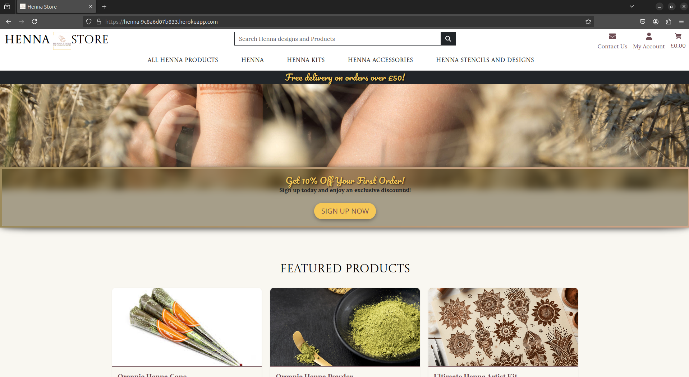

- Opera Browser Test
    - 

- Brave Browser Test
    - 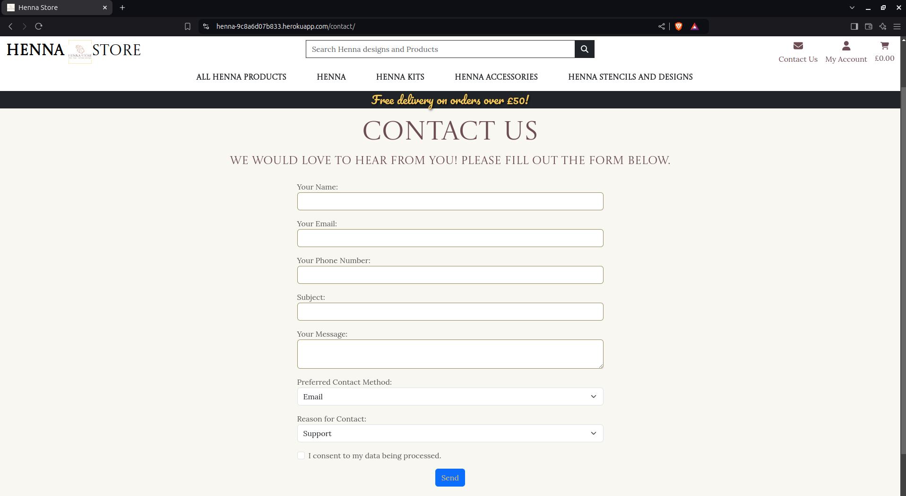
---

## Responsive

- Tested for different screen sizes
    - 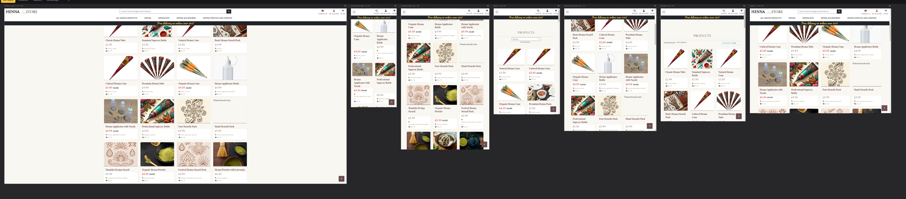


## W3Schools NU Validator

- **Home Page**

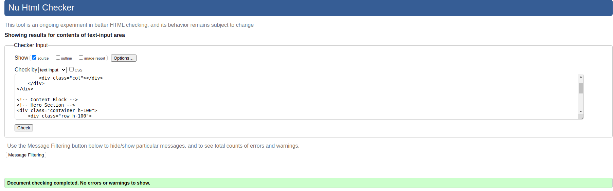

- **Contact-Us Page**

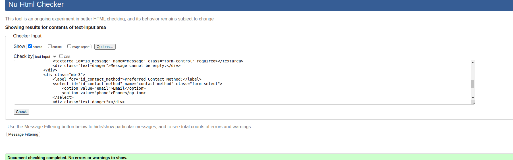

- **Products Page**

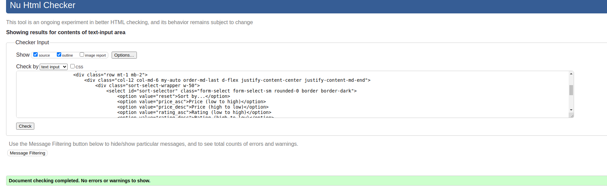


---

## Code Institutes Python Linter

-  **home/forms.py**

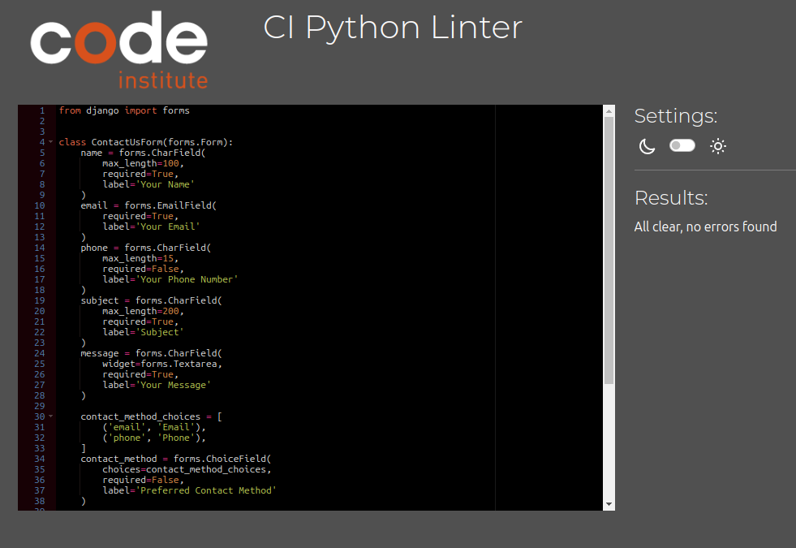

-  **home/views.py**

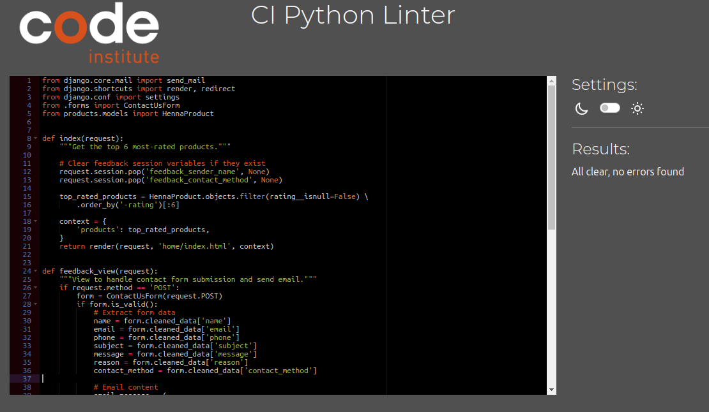

-  **products/forms.py**

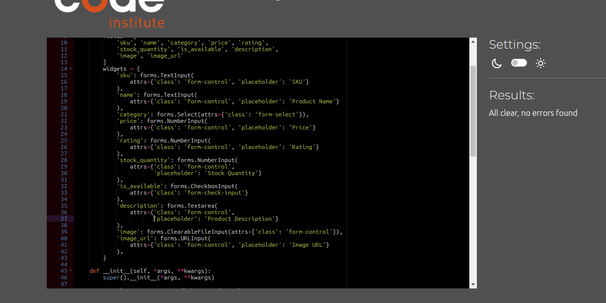

---

## JShint

-  **products/form-script.js**

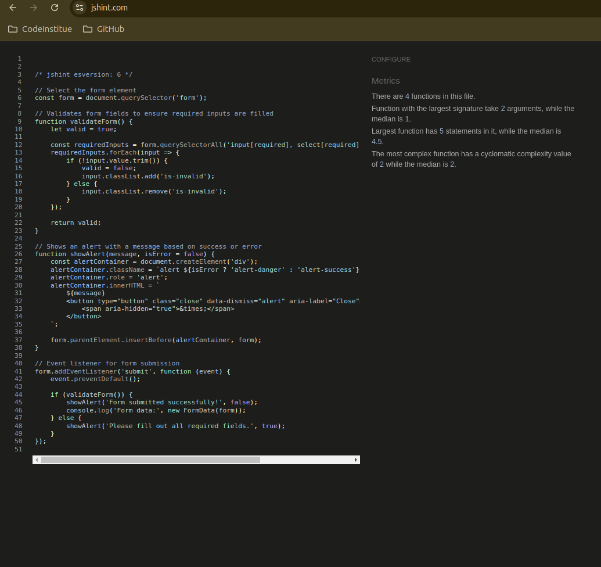

-  **checkout/chechout.py**

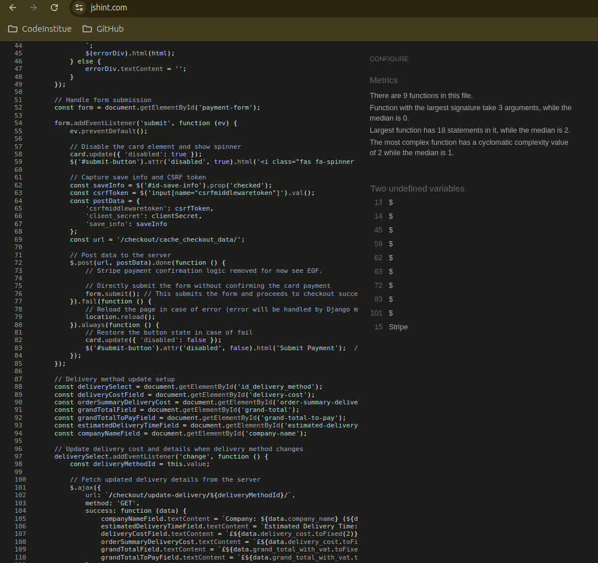

---

## Manual Testing

-  **Home Page** 

| Element                | Location          | Expected Behaviour                              | Tested | Passed | Comments                                     |
|------------------------|-------------------|-------------------------------------------------|--------|--------|----------------------------------------------|
| **Home** (Desktop)     | Top Navbar        | Navigates to the home page                      | Yes    | Yes    |                                              |
| **Profile** (Desktop)  | Top Navbar        | Navigates to the user's profile page            | Yes    | Yes    | Visible only when logged in                  |
| **Admin**              | Top Navbar        | Navigates to the admin panel                    | Yes    | Yes    | Visible only when user has admin role        |
| **Log Out**            | Top Navbar        | Logs the user out and redirects to the home page| Yes    | Yes    | Visible only when logged in                  |
| **Log in**             | Top Navbar        | Navigates to the login page                     | Yes    | Yes    | Visible only when not logged in              |
| **Register**           | Top Navbar        | Navigates to the registration page              | Yes    | Yes    | Visible only when not logged in              |
| **Menu** (Mobile)      | Mobile Navbar     | Opens the mobile navigation menu                | Yes    | Yes    |                                              |
| **Home** (Mobile)      | Mobile Navbar     | Navigates to the home page                      | Yes    | Yes    |                                              |
| **Profile** (Mobile)   | Mobile Navbar     | Navigates to the user's profile page            | Yes    | Yes    | Visible only when logged in                  |
| **Admin**              | Mobile Navbar     | Navigates to the admin panel                    | Yes    | Yes    | Visible only when user has admin role        |
| **Log Out**            | Mobile Navbar     | Logs the user out and redirects to the home page| Yes    | Yes    | Visible only when logged in                  |
| **Log In**             | Mobile Navbar     | Navigates to the login page                     | Yes    | Yes    | Visible only when not logged in              |
| **Register**           | Mobile Navbar     | Navigates to the registration page              | Yes    | Yes    | Visible only when not logged in              |
| **Contact Us**         | Top Navbar        | Opens the contact form page                     | Yes    | Yes    |                                              |
| **Shopping Cart**      | Top Navbar        | Navigates to the shopping cart page             | Yes    | Yes    | Shows the cart total                         |
| **Search Bar**         | Top Navbar        | Searches for products based on the input text   | Yes    | Yes    |                                              |
| **My Account Dropdown**| Top Navbar        | Expands to show account-related options         | Yes    | Yes    | Visible only when logged in                  |
| **Admin Dashboard Modal** | Modal Popup   | Warning modal before accessing the admin page   | Yes    | Yes    | Modal appears and handles admin access correctly |
| **Free Delivery Banner**| Header           | Displays free delivery information              | Yes    | Yes    | Updates dynamically based on threshold       |

---

-  **Checkout** 

| Element                      | Location                    | Expected Behaviour                                   | Tested | Passed | Comments                                     |
|------------------------------|-----------------------------|------------------------------------------------------|--------|--------|----------------------------------------------|
| Page Title                   | Head                        | Displays "Checkout" as the page title                | Yes    | Yes    |                                              |
| Order Summary Section         | Main Content               | Displays order summary with item count                | Yes    | Yes    |                                              |
| Order Summary Table          | Order Summary Section       | Shows images, names, prices, quantities, and subtotals for each item | Yes    | Yes    |                                              |
| Subtotal Row                 | Order Summary Table         | Displays the subtotal correctly                       | Yes    | Yes    |                                              |
| VAT Row                      | Order Summary Table         | Displays the VAT amount correctly                     | Yes    | Yes    |                                              |
| Delivery Cost Row            | Order Summary Table         | Displays the delivery cost correctly                  | Yes    | Yes    |                                              |
| Grand Total Row              | Order Summary Table         | Displays the grand total correctly                    | Yes    | Yes    |                                              |
| Free Delivery Alert          | Order Summary Section       | Shows a message for free delivery if applicable      | Yes    | Yes    |                                              |
| Checkout Form Section         | Main Content               | Displays the checkout form                            | Yes    | Yes    |                                              |
| Contact Details Fieldset     | Checkout Form Section       | Displays contact details fields                       | Yes    | Yes    |                                              |
| Shipping Information Fieldset | Checkout Form Section       | Displays shipping information fields                  | Yes    | Yes    |                                              |
| Delivery Method Fieldset     | Checkout Form Section       | Displays delivery method selection dropdown           | Yes    | Yes    |                                              |
| Delivery Info Display        | Delivery Method Fieldset    | Displays selected delivery method info                | Yes    | Yes    |                                              |
| Payment Information Fieldset  | Checkout Form Section       | Displays payment information fields                   | Yes    | Yes    |                                              |
| Submit Button                | Checkout Form Section       | Button for completing the order                      | Yes    | Yes    |                                              |
| Adjust Cart Button           | Checkout Form Section       | Button for adjusting the cart                         | Yes    | Yes    |                                              |
| Loading Overlay              | Page Bottom                 | Displays a loading spinner during checkout process    | Yes    | Yes    |                                              |
| CSRF Token                   | Form                        | Includes CSRF token for security                      | Yes    | Yes    |                                              |
| JavaScript Integration        | Page Bottom                 | Integrates Stripe payment processing                  | Yes    | Yes    |                                              |
| Error Handling Display       | Payment Information Fieldset | Displays card errors if payment fails                 | Yes    | Yes    |                                              |

---
---

## Automated Testing - Unit Tests

### Key Aspects of Automated Testing:

1. **Automation**: Tests can be run automatically, which saves time compared to manual testing.
   
2. **Repeatability**: You can run the tests multiple times without additional effort, ensuring consistent results across different stages of development.

3. **Immediate Feedback**: Automated tests provide immediate feedback when changes are made to the codebase, helping catch bugs early in the development process.

4. **Regression Testing**: They help ensure that new code changes do not break existing functionality.

5. **Continuous Integration**: Automated tests can be integrated into a continuous integration (CI) pipeline, allowing tests to run automatically with every code change.

---

### Test Suite Overview

This test suite validates the functionality of the `Discount` and `ProductsCategory` models in a Django application. The tests ensure correct model creation, method validation, and edge case handling, such as negative discounts and future discounts.

#### `DiscountModelTest`

- **setUp**: Creates a sample discount object for use in all tests.

- **test_discount_creation**: Verifies that the discount object has the correct attributes upon creation.

- **test_discount_string_representation**: Checks that the string representation combines the discount name and type as expected.

- **test_discount_validation_negative_value**: Ensures a `ValidationError` is raised for negative discount values, enforcing model validation rules.

- **test_discount_is_active**: Assesses the `is_active` method, verifying the effect of the active state and end date on discount activity.

#### `DiscountModelFutureDateTest`

- **setUp**: Creates a future discount object that should not be active.

- **test_future_discount_is_not_active**: Confirms that a future discount is correctly marked as inactive.

#### `ProductsCategoryModelTest`

- **setUp**: Creates a sample product category object for reuse in tests.

- **test_category_creation**: Verifies that the product category object is instantiated with the correct name and friendly name.

- **test_category_string_representation**: Checks that the string representation returns the category name.

- **test_get_friendly_name**: Validates the `get_friendly_name` method, ensuring it returns the friendly name or defaults to the category name if none is provided.

---

File test.py: [test.py](../products/tests.py)

To run test: `python manage.py test --verbosity 2`

Results: 

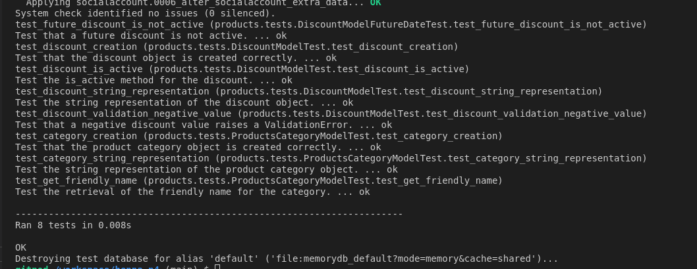


---

## Bugs and Fixes

### **Solved Bugs** 
 

**Bug Report: Quantity Not Included in Order Form Submission** 

  

**Bug:** The order form submission raises an error indicating that the quantity for product ID 5 is required. 

  

**Description:**   

Upon submitting the order form, the error message 'Quantity for product ID 5 is required' was displayed. This occurred because the quantity was not being captured from the form submission, which was necessary for processing the order. 

  

**Steps to Reproduce:** 

  

1. Navigate to the checkout page. 

2. Fill in the order form with customer details. 

3. Attempt to submit the form. 

4. Observe the error message regarding the missing quantity. 

  

**Expected Behaviour:**   

The order should be processed without errors, and the quantity should be included in the submission. 

  

**Actual Behaviour:**   

The submission fails with an error stating that the quantity for product ID 5 is required. 

  

**Original Code:**   

The order form was being processed without correctly handling the quantity from the cart. 
The relevant section of `checkout/views.py` is as follows: 

  

```python 

if request.method == 'POST': 

    print(request.POST)  # Debugging output 

    ... 

    # No need to get quantity from the form; use the cart's quantity 

    quantities = {} 

  

    for item in current_cart['cart_items']: 

        product_id = item['product'].id 

        quantity = item['quantity'] 

  

        print(f"Product ID: {product_id}, Cart Quantity: {quantity}")  # Debugging output 

        ... 

``` 

   

And the cart contents printed were: 

  

```plaintext 

[{'item_id': '4', 'quantity': 2, 'product': <HennaProduct: Henna Design Book for Beginners>, 'discounted_price': Decimal('12.99')}] 

``` 

  

**Solution:**   

To address this issue, I ensured that the quantities from the current cart were correctly processed in the form submission. 
The revised code now accurately retrieves and validates the quantities. 

  

**Fixed Code:** 

  

```python 

if request.method == 'POST': 

    ... 

    # Process quantities from the current cart 

    quantities = {} 

     

    for item in current_cart['cart_items']: 

        product_id = item['product'].id 

        quantity = item['quantity'] 

  

        # Validate the cart's quantity 

        if quantity <= 0: 

            messages.error(request, f"Quantity for product ID {product_id} must be greater than 0.") 

            return redirect('checkout') 

  

        quantities[product_id] = quantity  # Store valid quantities 

    ... 

``` 

  

**Summary:**   

By ensuring that the quantities from the current cart are retrieved and validated before form submission, the issue of the missing quantity was resolved. The order can now be processed successfully without raising errors related to the quantity. 

---

*Unit test bug report:* 
 
## Bug Report 

**Title:** ValidationError Not Raised for Negative Discount Value 

**Description:** 

A test case for the Discount model failed due to the inability to validate negative discount values. The absence of validation in the original model allowed negative discount values to be saved, leading to inconsistent data. 

**Steps to Reproduce:** 

Create a Discount object with a negative value. 

Attempt to save the object to the database. 

Check if a ValidationError is raised. 

```
from django.test import TestCase 
from django.core.exceptions import ValidationError 
from .models import Discount 
 
class DiscountModelTest(TestCase): 
    def test_discount_validation_negative_value(self): 
        """Test that a negative discount value raises a ValidationError.""" 
        discount = Discount(name='Negative Discount', discount_type='fixed', value=-10.00) 
        with self.assertRaises(ValidationError): 
            discount.save()  # Attempt to save the discount 
 ```

```python 

class Discount(models.Model): 
    """ 
    Model representing a discount that can be applied to products. 
    Can be either percentage-based or a fixed amount. 
    """ 
    DISCOUNT_TYPE_CHOICES = [ 
        ('percentage', 'Percentage'), 
        ('fixed', 'Fixed Amount'), 
    ] 
 
    name = models.CharField(max_length=100, unique=True) 
    discount_type = models.CharField(max_length=10, choices=DISCOUNT_TYPE_CHOICES) 
    value = models.DecimalField(max_digits=6, decimal_places=2) 
    start_date = models.DateTimeField(null=True, blank=True) 
    end_date = models.DateTimeField(null=True, blank=True) 
    active = models.BooleanField(default=True) 
     
    def __str__(self): 
        return f"{self.name} ({self.get_discount_type_display()})" 
 

New Code Snippet (After Update) 

```

```python 

class Discount(models.Model): 
    """ 
    Model representing a discount that can be applied to products. 
    Can be either percentage-based or a fixed amount. 
    """ 
    DISCOUNT_TYPE_CHOICES = [ 
        ('percentage', 'Percentage'), 
        ('fixed', 'Fixed Amount'), 
    ] 
 
    name = models.CharField(max_length=100, unique=True) 
    discount_type = models.CharField(max_length=10, choices=DISCOUNT_TYPE_CHOICES) 
    value = models.DecimalField(max_digits=6, decimal_places=2) 
    start_date = models.DateTimeField(null=True, blank=True) 
    end_date = models.DateTimeField(null=True, blank=True) 
    active = models.BooleanField(default=True) 
 
    def clean(self): 
        """Validate the discount value to ensure it is not negative.""" 
        if self.value < 0: 
            raise ValidationError('Discount value cannot be negative.') 
 
    def save(self, *args, **kwargs): 
        """Override save to call clean method before saving.""" 
        self.full_clean()  # This will call clean method 
        super().save(*args, **kwargs) 
 
    def __str__(self): 
        return f"{self.name} ({self.get_discount_type_display()})" 
 
    def is_active(self): 
        """Check if the discount is active and within its date range.""" 
        now = timezone.now() 
        return self.active and (self.start_date is None or self.start_date <= now) and (self.end_date is None or self.end_date >= now) 
 
```

**Expected Behaviour:** 

When attempting to save a Discount object with a negative value, a ValidationError should be raised. 

**Actual Behaviour:**

The original implementation did not raise a ValidationError, leading to a failure in the test case. 

**Resolution:**

After adding the clean method for validation and overriding the save method to call full_clean(), the test now passes as expected. 

**Test Result:** 

Test case for negative discount value: **Passed** 
--- 

## Unsolved bugs
**None known**